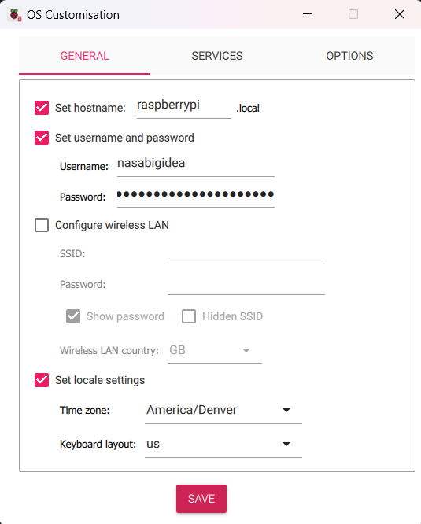
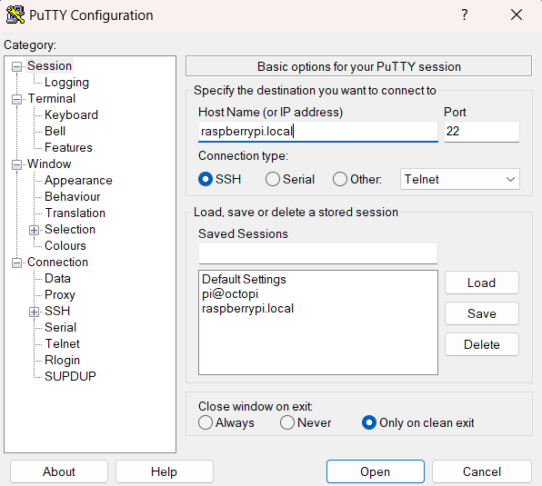
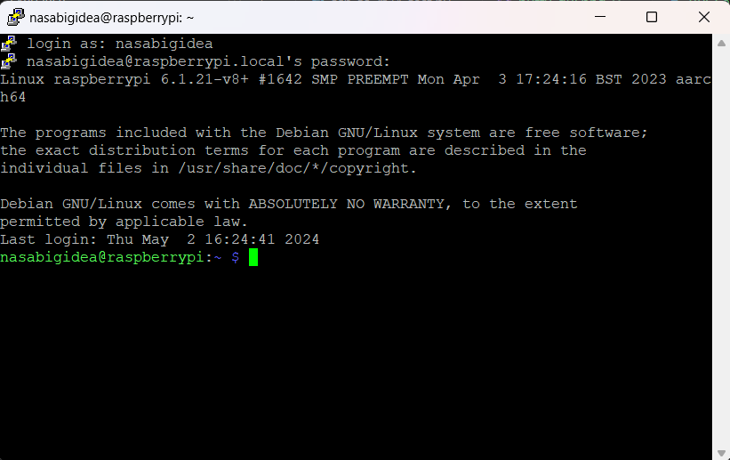
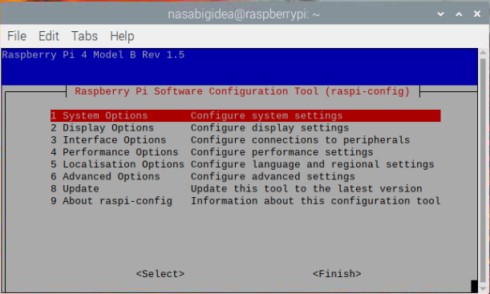
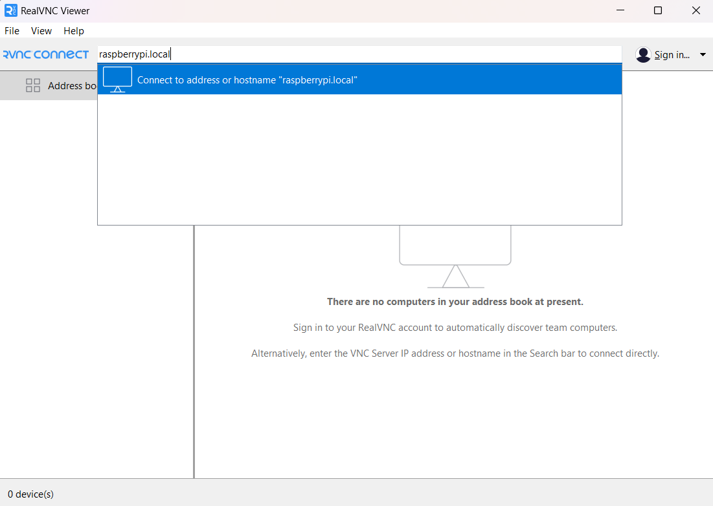
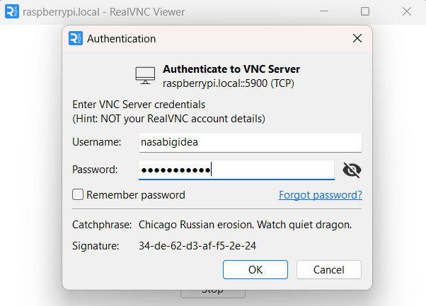
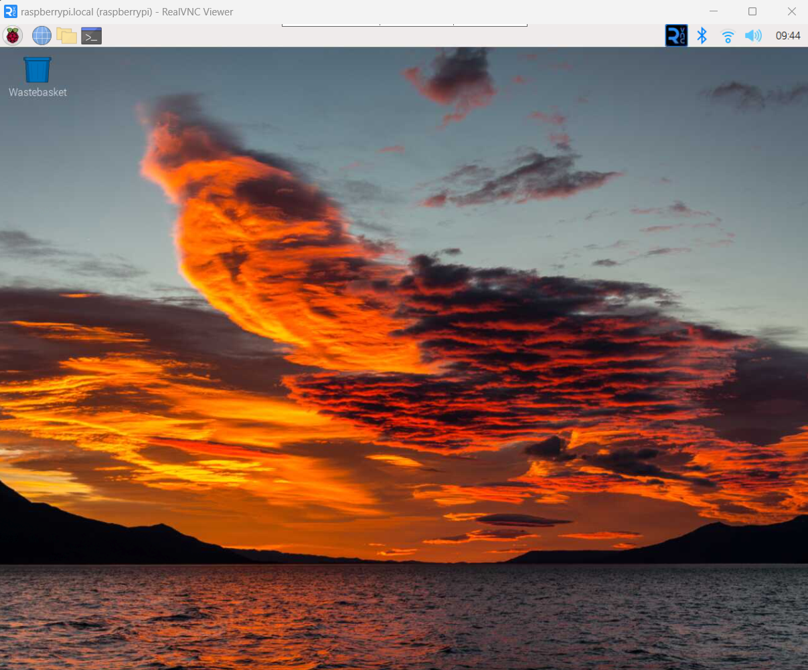
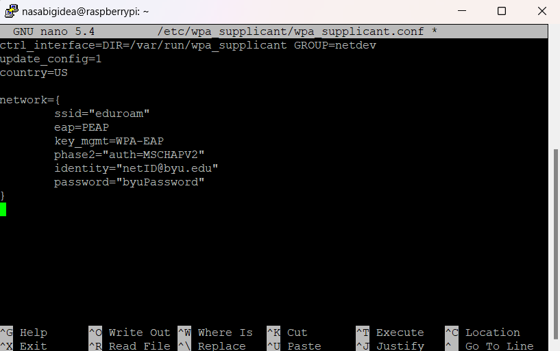

# Setup Process for RPi
## Purpose
The intent of this file is to provide the links, steps, and other information needed to go from a brand-new Raspberry Pi (RPi) to a functioning RPi in headless mode via SSH or VNC.

- [Basic Pi Setup](#basic-pi-setup)
- [SSH and Putty](#ssh-and-putty)
- [Virtual Network Computing (VNC)](#virtual-network-computing-vnc)
- [Configure WiFi](#configure-wifi)

**IMPORTANT**: Read all steps of a given section before beginning. These instructions assume you are using a Windows computer on BYU campus without access to a non-Eduroam network. For Linux users, it is somewhat assumed you're already competent in stuff like this.

Last Updated: 5/3/24 by Spencer Stowell

## Basic Pi Setup
1. Follow the steps outlined [here](https://https://www.raspberrypi.com/documentation/computers/getting-started.html) to configure an SD card for your RPi.
2. **OS Customisation Settings**
    - **General**

         
        
        - The standard password for lab hardware like this is `theusevitch`.
        - If using Eduroam, the wifi will be configured at a later step. Otherwise enter the **SSID** and **Password** for the desired network.
    - **Services**
        - Enable `SSH` and select `Use password authentication`.
        - This setting will be useful for remote access to the RPi after setup.

3. Once the SD card has been flashed, insert it into the RPi, connect the RPi to a power source, and wait for it to boot up (1-2 min). If the RPi is connected to a monitor, keyboard, and mouse, the setup process can be completed directly on the RPi. Otherwise, setup can be completed using SSH. The following sections will give instructions for SSH.

## SSH and Putty
These steps use a software called Putty, which simplifies the process of connecting to the RPi via SSH from a Windows machine. An alternative option is to use Windows PowerShell (not covered here).
1. Download and install [Putty](https://www.putty.org/).
2. Connect the RPi to your computer using an Ethernet cable.
3. Open Putty and enter `hostname.local` under the **Host name (or IP address)** field, where `hostname` matches the value set during the [**OS Customisation**](#basic-pi-setup) step.
4. Set the port number to 22, the connection type to SSH, and select **Open** at the bottom of the popup.
- 
5. If the RPi is powered, has finished booting, is connected via Ethernet to your computer, and you have the correct hostname, a terminal should pop up asking for your login credentials. When prompted, enter the username and password for the RPi. If successful, you should see something similar to the image below.

- 

## Virtual Network Computing (VNC)
This option is for convenience only and is not necessary for experienced Linux/Python users. A VNC server allows you to access the RPi's desktop (not just command line) remotely. This is only possible if the RPi is connected via Ethernet to the host computer (same requirements as SSH).

1. In the SSH terminal, enter `sudo raspi-config` to open the Raspberry Pi Configuration Tool.
- 
2. Using the arrow keys, navigate to **Display Options -> VNC Resolution** and select a display resolution for headless mode. A good option for a typical laptop is `1280x1024`.
3. Navigate to **Interfacing Options -> VNC** and select **Yes** to enable VNC. If prompted to restart, select **Yes**. Otherwise return to the terminal and enter `sudo reboot now`. The RPi will disconnect from the putty terminal, which will need to be closed then reinitialized using steps 3-5 of [SSH and Putty](#ssh-and-putty).
4. On the host computer, install the **RealVNC Viewer** app from the Microsoft Store or download directly from the [RealVNC website](https://www.realvnc.com/en/connect/download/viewer/).
5. Once a new SSH session is established and RealVNC Viewer is installed, launch the viewer, type `hostname.local` in the address bar (where `hostname` is the same as for SSH) and press enter.
- 
6. A new window will pop up asking for the username and password of the RPi. These are the same credentials used to log in via SSH. Fill out both fields and press `OK`.
- 
7. If you correctly entered the credentials, you should see the RPi desktop in the RealVNC Viewer window. You can now interact with the RPi from the host computer as if you were using a monitor, keyboard, and mouse connected directly to the RPi.
- 

There is also a mobile app version of RealVNC Viewer that can be used to access the RPi from a phone or tablet. This is only feasible if the RPi is connected to the same non-Eduroam network as the mobile device.

## Configure WiFi
Follow the instructions outlined [here](https://inrg.engineering.ucsc.edu/howto-connect-raspberry-to-eduroam/) to set up Eduroam via the command line (Putty or VNC).
- **Note**: Step 9 has some inputs specific to UCSC. Use the following adjustments for BYU:
- 

With the WiFi connected, the RPi is ready to install the necessary python libraries for the nRF24 network and TCP client, as well as connect to the Github repository for the project.