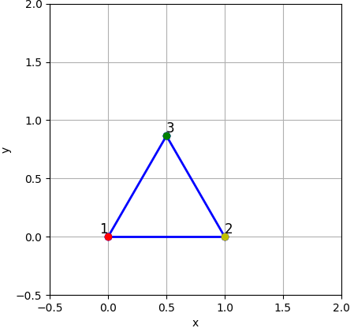
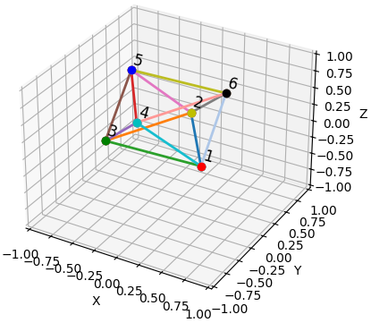
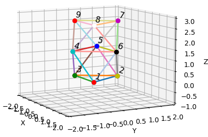
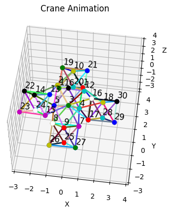

# Python code for NASA Big Idea Challenge
This folder contains all the python scripts for visualization, simulation, and control of the robots used in the NASA Big Idea challenge at Brigham Young University, 2024.

## Table of Contents

**[Triangle](/Python_dynamics_code/Triangle/):** Contains all files necessary to run a single equilateral triangle simulation.

 

**[Octahedron](/Python_dynamics_code/Octahedron/):** Contains all files necessary to run an octahedron simulation with equal side lengths.

**[Solar Panel Array](/Python_dynamics_code/Solar_Array/):** Contains all files necessary to run a solar panel array simulation

**[Crane](/Python_dynamics_code/Crane/):** Contains all files necessary to run a crane simulation

## File Explanations

### Dynamics
Each Dynamics file constains an `update`, `f`, `h`, and `rk4_step` function.
- `update`: Calls the `rk4_step` function with an input `u`, then calls the `h` function.
- `f`: Accepts the state vector and inputs to the system as numpy arrays, then calculates the derivative of each state and returns it as a numpy array. All dynamic equations are written and used in this function.
- `h`: Collects and returns the cartesian coordinates of each node as a numpy array: x, y (and z if working in 3D).
- `rk4_step`: Computes one time step into the future for the dynamic simulation via an RK4 algorithm.

### Param
Each Param file contains the physical parameters of the given system. These parameters include the spring and damping coefficients, start, end, and interval times, gravity vectors, and initial conditions for each node.

### Sim
Each Sim file contains all the maplotlib pyplot objects required to get a proper visualization of the truss structure as the dynamic model propagates in time. This includes node and line objects, each of which is updated for each step, Ts, according to the results of the dynamic model. The function at the core of each simulation is `FuncAnimation`, which enables the user to select which figure and functions they would like to propagate for each frame of animation.

One additional feature embedded in the octahedron and triangle code is the option to save a given simulation as a `.mp4`.

### Signal Generators
The `signal_generator.py` file located in the general directory and each of the duplicate files located in the system-specific sub-directories are used to implement input forces to each dynamic simulation. The file itself contains code to generate step, square, sine, sawtooth, and random inputs for any given time step. A signalGenerator object is initialized with an amplitude, frequency, and y-offset.

Additional information can be found in the notes at the start of the file.

### Rigidity Matrices
The final file located in each folder correlates to the rigidity matrix required for that configuration. As of 7/15/24 these files only return a single kinematic configuration of each robot, and are not updated to conform to a specific path or sequence of robot movement.
 

